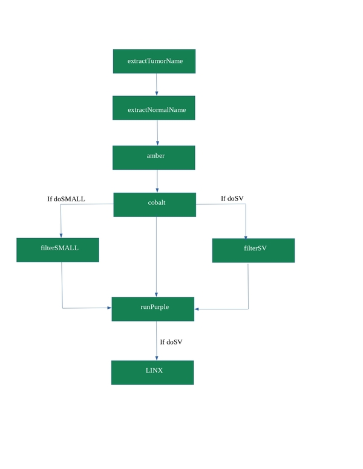

# purple

performs purity and ploidy estimation

## Overview
This workflow integrated some tools from hmftools (https://github.com/hartwigmedical/hmftools), including AMBER, COBALT, GRIPSS, PURPLE and LINX. It combines B-allele frequency (BAF) from AMBER, read depth ratios from COBALT, somatic variants and structural variants to estimate the purity and copy number profile of a tumor sample. 

The optional tasks are filterSMALL, which uses bcftools to filter a vcf, provides an optional argument for PURPLE; and task FilterSV, which uses GRIPSS (GRIDSS Post Somatic Software) to apply a set of filtering and post processing steps on GRIDSS (https://github.com/PapenfussLab/gridss) paired tumor-normal output to produce a high confidence set of somatic SV for a tumor sample, provides a somatic vcf to serve as another optional argument for PURPLE. 

If performed the optional task filterSV, then the results of PURPLE will go through a step to run on LINX, which is an annotation, interpretation and visualisation tool for structural variants. The primary function of LINX is grouping together individual SV calls into distinct events and properly classify and annotating the event to understand both its mechanism and genomic impact.

The mandatory arguments for this workflow are paired tumor-normal bam files for AMBER and COBALT. The optional arguments are a vcf input from mutect2 (for optional task filterSMALL), and a vcf input from GRIDSS (for optional task filterSV). All vcf file tumor and normal sample names in the header should match the sample names in the tumor bam and normal bam header respectively.



## Dependencies

* [PURPLE](https://github.com/hartwigmedical/hmftools/blob/master/purple/README.md)
* [AMBER](https://github.com/hartwigmedical/hmftools/blob/master/amber/README.md)
* [COBALT](https://github.com/hartwigmedical/hmftools/blob/master/cobalt/README.md)
* [Linx](https://github.com/hartwigmedical/hmftools/blob/master/linx/README.md)
* [bcftools](https://www.htslib.org/doc/1.9/bcftools.html)


## Usage

### Cromwell
```
java -jar cromwell.jar run purple.wdl --inputs inputs.json
```

### Inputs

#### Required workflow parameters:
Parameter|Value|Description
---|---|---
`tumour_bam`|File|Input tumor file (bam)
`tumour_bai`|File|Input tumor file index (bai)
`normal_bam`|File|Input normal file (bam)
`normal_bai`|File|Input normal file index (bai)


#### Optional workflow parameters:
Parameter|Value|Default|Description
---|---|---|---
`genomeVersion`|String|"38"|Genome Version, only 38 supported
`doSV`|Boolean|true|include somatic structural variant calls, true/false
`doSMALL`|Boolean|true|include somatic small (SNV+indel) calls, true/false


#### Optional task parameters:
Parameter|Value|Default|Description
---|---|---|---
`extractTumorName.memory`|Int|4|Memory allocated for this job (GB)
`extractTumorName.timeout`|Int|4|Hours before task timeout
`extractNormalName.memory`|Int|4|Memory allocated for this job (GB)
`extractNormalName.timeout`|Int|4|Hours before task timeout
`amber.amberScript`|String|"java -Xmx32G -cp $HMFTOOLS_ROOT/amber.jar com.hartwig.hmftools.amber.AmberApplication"|location of AMBER script
`amber.min_mapping_quality`|Int|30|Minimum mapping quality for an alignment to be used
`amber.min_base_quality`|Int|25|Minimum quality for a base to be considered
`amber.threads`|Int|8|Requested CPU threads
`amber.memory`|Int|32|Memory allocated for this job (GB)
`amber.timeout`|Int|100|Hours before task timeout
`cobalt.colbaltScript`|String|"java -Xmx8G -cp $HMFTOOLS_ROOT/cobalt.jar com.hartwig.hmftools.cobalt.CobaltApplication"|location of COBALT script
`cobalt.gamma`|String|300|gamma (penalty) value for segmenting
`cobalt.min_mapping_quality`|Int|30|Minimum mapping quality for an alignment to be used
`cobalt.threads`|Int|8|Requested CPU threads
`cobalt.memory`|Int|32|Memory allocated for this job (GB)
`cobalt.timeout`|Int|100|Hours before task timeout
`filterSV.vcf`|File?|None|VCF file for filtering
`filterSV.gripssScript`|String|"java -Xmx80G -jar $HMFTOOLS_ROOT/gripss.jar"|location and java call for gripss jar
`filterSV.hard_min_tumor_qual`|Int|500|Any variant with QUAL less than x is filtered 
`filterSV.filter_sgls`|String|"-filter_sgls"|include filtering of single breakends
`filterSV.memory`|Int|80|Memory allocated for this job (GB)
`filterSV.threads`|Int|1|Requested CPU threads
`filterSV.timeout`|Int|100|Hours before task timeout
`filterSMALL.vcf`|File?|None|VCF file for filtering
`filterSMALL.vcf_index`|File?|None|index of VCF file for filtering
`filterSMALL.bcftoolsScript`|String|"$BCFTOOLS_ROOT/bin/bcftools"|location for bcftools
`filterSMALL.genome`|String|"$HG38_ROOT/hg38_random.fa"|reference fasta
`filterSMALL.regions`|String|"chr1,chr10,chr11,chr12,chr13,chr14,chr15,chr16,chr17,chr18,chr19,chr2,chr20,chr21,chr22,chr3,chr4,chr5,chr6,chr7,chr8,chr9,chrX"|regions/chromosomes to include
`filterSMALL.difficultRegions`|String|"--targets-file $HG38_DAC_EXCLUSION_ROOT/hg38-dac-exclusion.v2.bed"|regions to exclude because they are difficult
`filterSMALL.tumorVAF`|String|"0.01"|minimum variant allele frequency for tumour calls to pass filter
`filterSMALL.modules`|String|"bcftools/1.9 hg38/p12 hg38-dac-exclusion/1.0"|Required environment modules
`filterSMALL.threads`|Int|8|Requested CPU threads
`filterSMALL.memory`|Int|32|Memory allocated for this job (GB)
`filterSMALL.timeout`|Int|100|Hours before task timeout
`runPURPLE.solution_name`|String|"Primary"|Name of solution
`runPURPLE.outfilePrefix`|String|tumour_name + ".sol" + solution_name|Prefix of output file
`runPURPLE.min_diploid_tumor_ratio_count`|Int|60|smooth over contiguous segments which are fewer than this number of depth windows long and which have no SV support on either side and which are bounded on both sides by copy number regions which could be smoothed together using our normal smoothing rules.
`runPURPLE.purpleScript`|String|"java -Xmx8G -jar $HMFTOOLS_ROOT/purple.jar"|location of PURPLE script
`runPURPLE.min_ploidy`|String?|None|minimum ploidy
`runPURPLE.max_ploidy`|String?|None|max ploidy
`runPURPLE.min_purity`|String?|None|mininimum purity
`runPURPLE.max_purity`|String?|None|max purity
`runPURPLE.ploidy_penalty_factor`|String?|None|multiplies aggregate event penalty by this factor
`runPURPLE.ploidy_penalty_standard_deviation`|String?|None|not entirely sure what this does
`runPURPLE.threads`|Int|8|Requested CPU threads
`runPURPLE.memory`|Int|32|Memory allocated for this job (GB)
`runPURPLE.timeout`|Int|100|Hours before task timeout
`expandAlternates.min_alternate_ploidy`|Int|1|Minimum of alternative ploidy
`expandAlternates.max_alternate_ploidy`|Int|8|Maximum of alternative ploidy
`expandAlternates.alternate_ploidy_step`|Int|1|NUmber of steps
`expandAlternates.jobMemory`|Int|1|Memory allocated for this job (GB)
`expandAlternates.timeout`|Int|1|Hours before task timeout
`expandAlternates.modules`|String|"python/3.10.6"|Required environment modules
`runPURPLEAlternates.outfilePrefix`|String|tumour_name + ".sol" + solution_name|Prefix of output file
`runPURPLEAlternates.min_diploid_tumor_ratio_count`|Int|60|smooth over contiguous segments which are fewer than this number of depth windows long and which have no SV support on either side and which are bounded on both sides by copy number regions which could be smoothed together using our normal smoothing rules.
`runPURPLEAlternates.purpleScript`|String|"java -Xmx8G -jar $HMFTOOLS_ROOT/purple.jar"|location of PURPLE script
`runPURPLEAlternates.min_purity`|String?|None|mininimum purity
`runPURPLEAlternates.max_purity`|String?|None|max purity
`runPURPLEAlternates.ploidy_penalty_factor`|String?|None|multiplies aggregate event penalty by this factor
`runPURPLEAlternates.ploidy_penalty_standard_deviation`|String?|None|not entirely sure what this does
`runPURPLEAlternates.threads`|Int|8|Requested CPU threads
`runPURPLEAlternates.memory`|Int|32|Memory allocated for this job (GB)
`runPURPLEAlternates.timeout`|Int|100|Hours before task timeout
`group_alternates.jobMemory`|Int|1|Memory allocated for this job (GB)
`group_alternates.threads`|Int|1|Requested CPU threads
`group_alternates.timeout`|Int|2|Hours before task timeout
`LINX.linxScript`|String|"java -Xmx32G -cp $HMFTOOLS_ROOT/linx.jar com.hartwig.hmftools.linx.LinxApplication"|location of LINX script
`LINX.threads`|Int|8|Requested CPU threads
`LINX.memory`|Int|32|Memory allocated for this job (GB)
`LINX.timeout`|Int|100|Hours before task timeout


### Outputs

Output | Type | Description | Labels
---|---|---|---
`purple_directory`|File?|Zipped results from PURPLE|vidarr_label: purple_directory
`purple_alternate_directory`|File|Directory for alternate solution files|vidarr_label: purple_alternate_directory
`purple_qc`|File|QC results from PURPLE|vidarr_label: purple_qc
`purple_purity`|File|tab seperated Purity estimate from PURPLE|vidarr_label: purple_purity
`purple_purity_range`|File|tab seperated range of Purity estimate from PURPLE|vidarr_label: purple_purity_range
`purple_segments`|File|tab seperated segments estimated by PURPLE|vidarr_label: purple_segments
`purple_cnv`|File|tab seperated somatic copy number variants from PURPLE|vidarr_label: purple_cnv
`purple_cnv_gene`|File|tab seperated somatic gene-level copy number variants from PURPLE|vidarr_label: purple_cnv_gene
`purple_SV_index`|File?|Structural Variant .vcf index edited by PURPLE|vidarr_label: purple_SV_index
`purple_SV`|File?|Structural Variant .vcf edited by PURPLE|vidarr_label: purple_SV
`purple_SMALL_index`|File?|SNV+IN/DEL .vcf index edited by PURPLE|vidarr_label: purple_SMALL_index
`purple_SMALL`|File?|SNV+IN/DEL .vcf edited by PURPLE|vidarr_label: purple_SMALL


## Commands
  This section lists commands run by the PURPLE workflow
  
  ### Run AMBER 
   
       ~{amberScript} \
         -reference ~{normal_name} -reference_bam ~{normal_bam} \
         -tumor ~{tumour_name} -tumor_bam ~{tumour_bam} \
         -output_dir ~{tumour_name}.amber/ \
         -loci ~{PON} \
         -ref_genome_version ~{genomeVersion}
   
   ### Run COBALT 
   
       ~{colbaltScript} \
         -reference ~{normal_name} -reference_bam ~{normal_bam} \
         -tumor ~{tumour_name} -tumor_bam ~{tumour_bam} \
         -output_dir ~{tumour_name}.cobalt/ \
         -gc_profile ~{gcProfile} \
         -pcf_gamma ~{gamma}
   
   ### Filter structural variant VCFs using GRIPSS, this is optional but recommended
   
       ~{gripssScript} \
           -vcf ~{vcf}  \
           -sample ~{tumour_name} -reference ~{normal_name} \
           -ref_genome_version ~{genomeVersion} \
           -ref_genome ~{refFasta} \
           -pon_sgl_file ~{pon_sgl_file} \
           -pon_sv_file ~{pon_sv_file} \
           -known_hotspot_file ~{known_hotspot_file} \
           -repeat_mask_file ~{repeat_mask_file} \
           -output_dir gripss/ \
           -hard_min_tumor_qual ~{hard_min_tumor_qual} \
           ~{filter_sgls}
   
   ### Filter small variant (SNV + in/del) VCFs using bcftools, this is optional but recommended
   
        ~{bcftoolsScript} view -f "PASS" -S samples.txt -r ~{regions} ~{difficultRegions} ~{vcf} |\
        ~{bcftoolsScript} norm --multiallelics - --fasta-ref ~{genome} |\
        ~{bcftoolsScript} filter -i "(FORMAT/AD[1:1])/(FORMAT/AD[1:0]+FORMAT/AD[1:1]) >= ~{tumorVAF}"  > ~{tumour_name}.PASS.vcf
   
   ### Run PURPLE 
   
       ~{purpleScript} \
         -ref_genome_version ~{genomeVersion} \
         -ref_genome ~{refFasta}  \
         -gc_profile ~{gcProfile} \
         -ensembl_data_dir ~{ensemblDir}  \
         -reference ~{normal_name} -tumor ~{tumour_name}  \
         -amber ~{tumour_name}.amber -cobalt ~{tumour_name}.cobalt \
         ~{"-somatic_sv_vcf " + SV_vcf} \
         ~{"-somatic_vcf " + smalls_vcf} \
         -output_dir ~{tumour_name}.purple \
         -no_charts
   
   ### Run LINX, if structural variant calls from GRIDSS are included
   
       ~{linxScript} \
         -sample ~{tumour_name} \
         -ref_genome_version ~{genomeVersion} \
         -ensembl_data_dir ~{ensemblDir}  \
         -check_fusions \
         -known_fusion_file ~{fusions_file} \
         -purple_dir ~{tumour_name}.purple \
         -output_dir ~{tumour_name}.linx 
 ## Support

For support, please file an issue on the [Github project](https://github.com/oicr-gsi) or send an email to gsi@oicr.on.ca .

_Generated with generate-markdown-readme (https://github.com/oicr-gsi/gsi-wdl-tools/)_
